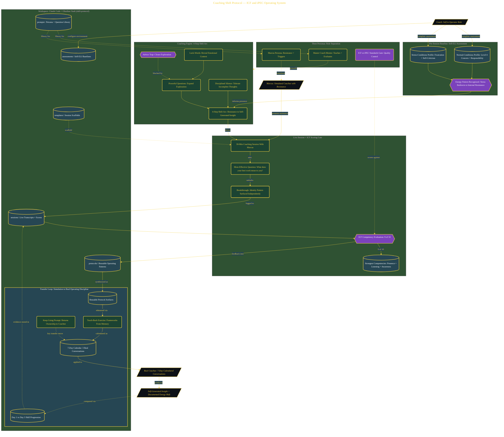

# Coach Anyone From Stuck to Action

> Inside the [Leadership Systems Engineering](../../README.md) portfolio · *Leadership frameworks from formal coursework, engineered as working systems.*

## Overview

A coaching operating system that engineers the **ICF (International Coach Federation)** core competencies and **iPEC** energy-coaching framework into a measurable, repeatable workflow inside Claude Code + an Obsidian vault. Where Stanford Decision Quality (the lens's other system) treats decisions as structured artifacts, this system treats coaching conversations the same way — turning subjective interaction into scored, documented practice.

The vault scaffolds three personas (a Master Coach Mentor, a resistant coachee named Marcus, and an ICF/iPEC Standards Gate that scores every session), a Self-ELI energy-baseline assessment, and the **4-Step Shift Arc** as the coaching engine. A scored live session with Marcus produced a documented 9/10 ICF competency rating, with presence, active listening, and awareness generation as the strongest competencies. The protocol then transfers out of simulation into seven days of calendared real conversations, and a Day-1-vs-Day-3 progression check.

The architecture below shows the operating loop: Self-ELI baseline → 4-Step Shift Arc + powerful-questions engine → live session with Marcus → ICF competency scoring gate → reusable protocol artifacts → 7-day real-world transfer.

## Architecture

The diagram shows the topology and data flow of the system as built. The full architectural narrative, with screenshots and prose, lives in [`documents/coaching-shift-protocol.md`](./documents/coaching-shift-protocol.md).

## Implementation

This system is built across **8 phases**:

1. **Setting Up the Coaching Skills Environment**
2. **Building the Shift Protocol Vault**
3. **Establishing Your Energy Baseline: Self-ELI Assessment**
4. **Mastering Powerful Questions vs. Advice-Giving**
5. **Conducting a Live Coaching Session with Marcus**
6. **Scoring the Session: ICF Competency Evaluation**
7. **Building a Reusable Protocol and 7-Day Transfer System**
8. **Deploying the Protocol on a Real Person**

For the full walkthrough with screenshots and step-by-step content, see [`documents/coaching-shift-protocol.md`](./documents/coaching-shift-protocol.md).

## Validation

Build outcomes verified end-to-end. Each phase below is captured with screenshots, configuration, and observable behavior in [`documents/coaching-shift-protocol.md`](./documents/coaching-shift-protocol.md):

- ✅ Setting Up the Coaching Skills Environment
- ✅ Building the Shift Protocol Vault
- ✅ Establishing Your Energy Baseline: Self-ELI Assessment
- ✅ Mastering Powerful Questions vs. Advice-Giving
- ✅ Conducting a Live Coaching Session with Marcus
- ✅ Scoring the Session: ICF Competency Evaluation
- ✅ Building a Reusable Protocol and 7-Day Transfer System
- ✅ Deploying the Protocol on a Real Person
