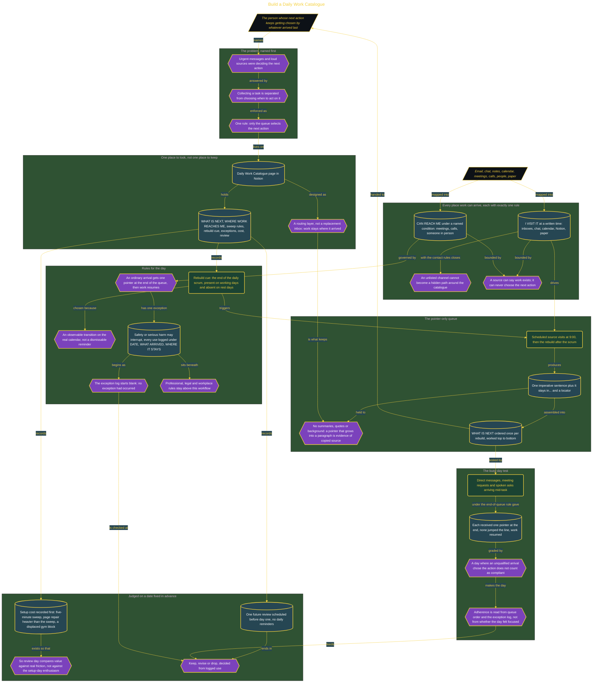

# Build a Daily Work Catalogue

> Inside the [Leadership Systems Engineering](../../README.md) portfolio · *Leadership frameworks from formal coursework, engineered as working systems.*

## Overview

I built the Daily Work Catalogue to stop urgent messages, recent notifications, and loud sources from deciding what I worked on next. Those arrivals could still contain legitimate work, but their timing did not establish priority. I needed one ordered queue that separated collecting a task from choosing when to act on it.

The catalogue became the only place allowed to select my next action. Email, Slack, Notion, meetings, calls, and paper could introduce work, but each ordinary item had to become a pointer and enter the queue in order. I then returned to the action already underway. This system did not prevent every interruption or replace professional judgment. It established a default rule: incoming work waited unless it met the written safety exception. The outcome was a visible decision path that I could review later instead of reconstructing from notifications, memory, or whichever source I happened to open first.

The architecture is built across **7 phases**, anchored by **Choosing What Guides the Next Action** on the input side and **Auditing the Queue on a Busy Day** at the end. Each phase is listed in the Implementation section below.

## Architecture

The diagram shows the topology and data flow of the system as built. The full architectural narrative, with screenshots and prose, lives in [`documents/daily-work-catalogue.md`](./documents/daily-work-catalogue.md).

## Implementation

This system is built across **7 phases**:

1. **Choosing What Guides the Next Action**
2. **Creating One Place to Look**
3. **Mapping Every Place Work Arrives**
4. **Setting Boundaries for Daily Work**
5. **Building a Pointer-Only Daily Queue**
6. **Precommitting to a Review Decision**
7. **Auditing the Queue on a Busy Day**

For the full walkthrough with screenshots and step-by-step content, see [`documents/daily-work-catalogue.md`](./documents/daily-work-catalogue.md).

## Validation

Each build phase below is documented in [`documents/daily-work-catalogue.md`](./documents/daily-work-catalogue.md), with screenshots, configuration, and notes as captured during the build:

- ✅ Choosing What Guides the Next Action
- ✅ Creating One Place to Look
- ✅ Mapping Every Place Work Arrives
- ✅ Setting Boundaries for Daily Work
- ✅ Building a Pointer-Only Daily Queue
- ✅ Precommitting to a Review Decision
- ✅ Auditing the Queue on a Busy Day
