# Start the Pineapple Advisory Notebook

> Inside the [Leadership Systems Engineering](../../README.md) portfolio · *Leadership frameworks from formal coursework, engineered as working systems.*

## Overview

I started the Pineapple Advisory Notebook by recording three unanswered questions and one reason for creating the system. I did not attempt to answer the questions during setup because that would have mixed investigation with the evidence defining what still needed to be learned. The founding note therefore preserved uncertainty rather than presenting early assumptions as conclusions.

The reason line established one central location for questions, rules, and evidence. This gave the notebook a clear function without expanding it into a general knowledge base or an automated decision-maker. Questions identified what remained unknown, rules constrained how the notebook could be used, and evidence supported later review. Keeping these categories together made the starting state easy to inspect. The notebook began as a governed record for personal AI risk, not as proof that any risk had already been understood, reduced, or resolved.

The architecture is built across **6 phases**, anchored by **Starting with Questions and Evidence** on the input side and **Protecting the Tested Boundary** at the end. Each phase is listed in the Implementation section below.

## Architecture

```mermaid
---
title: Start the Pineapple Advisory Notebook
---
%%{init: {"theme":"base","themeVariables": {"primaryColor":"#1B4332","primaryTextColor":"#F4D03F","primaryBorderColor":"#F4D03F","secondaryColor":"#264653","tertiaryColor":"#2F5233","lineColor":"#F4D03F","fontFamily":"ui-monospace, SFMono-Regular, Menlo, Consolas, monospace","fontSize":"13px"}}}%%
flowchart TD
    classDef datastore fill:#264653,stroke:#F4D03F,stroke-width:2px,color:#FFFFFF
    classDef service fill:#1B4332,stroke:#F4D03F,stroke-width:2px,color:#F4D03F
    classDef event fill:#7B42BC,stroke:#F4D03F,stroke-width:2px,color:#FFFFFF
    classDef io fill:#0d1117,stroke:#F4D03F,stroke-width:1.5px,color:#F4D03F,font-style:italic

    Author[/The operator, who owns every question, entry and judgment/]
    Claude[/Claude, held to the saved instructions and used only for constrained checks/]
    Audience[/Family, friends and later small businesses the notebook is kept for/]

    subgraph Founding["The founding note, written before any answer"]
        Questions[(Three unanswered questions and one reason line: questions, rules, evidence)]
        NoAnswer{{No question answered during setup, so investigation never mixes with the record of what is unknown}}
        Baseline[(Otherwise empty workspace, so every later file is attributable to a build step)]
        Usage{{Claude desktop on a Max plan at 7 percent of the window: session context, not proof of correctness}}
    end

    subgraph Packet["The notebook packet"]
        Workspace(Pineapple Advisory AI Lab: one governed workspace for personal AI-risk questions)
        Instructions[(Project Instructions: purpose, limits, evidence requirements, uncertainty, consent, dated 2026-09-15)]
        Template[(Entry Template: the fields every entry must carry)]
        Entries[(Entries log: completed records and fixture results)]
        Separate{{Permanent rules kept apart from entries, so recording a concern never rewrites the rules}}
        TwoCopies[(Local desktop folder plus matching PDFs in Claude Project knowledge)]
    end

    subgraph Categories["Four instruction categories, checked line by line"]
        Purpose[(Purpose: examine AI-enabled harm for the operator, family, friends, later small businesses)]
        Limits[("Limits: three never lines supplied and preserved verbatim, including sends, signs or files")]
        Sourced[(Answers name their source and date and state uncertainty)]
        Consent[(Consent required before using another person's data)]
        Matched{{Each line reported as matched or corrected, never as looks fine}}
    end

    subgraph Fixture["The fresh-chat fixture"]
        PassRule{{Pass defined before the run: exactly three lines, character for character, nothing else}}
        FreshChat(New chat inside the Project, one narrow prompt asking for the boundary lines only)
        Result[(Three lines returned, capitalization, order and punctuation exact)]
        OneFixture{{Validates one strict boundary and detects wording drift later; it does not prove universal compliance}}
    end

    subgraph Honest["Keeping the fixture check honest"]
        Prediction[("Written first, in the operator's words: Proof: The packet should still open tomorrow")]
        NotEvidence{{A prediction is not evidence, and a wrong one would have been logged as a hint used}}
        CheckPrompt(Check prompt names only that line and forbids disclosing any other fixture content)
        ProofPage[(Proof page: observed outcome, no hint used, single confirmation line, operator authorship)]
    end

    subgraph Entry["Entry 002: a real AI risk, dated"]
        Concern[(Three sentences, three missing-information lines, an authorship statement)]
        NextCheck(Read the permission and activity logs; record what an agent can reach without per-action approval)
        NotFix{{Looking and documenting, not changing settings or claiming the system got safer}}
        Unresolved{{The concern stays open until the evidence is collected}}
    end

    subgraph Equality["Words preserved across both copies"]
        Regen(Replacement PDF generated from the local draft, extracted text normalized and compared)
        CompareTrue[(Comparison returned True; the same binary uploaded, so both copies are byte-identical)]
        Eleven[(11-point checklist: date, entry sentences, missing-information lines, proof sentence, authorship, boundary lines)]
        NotCorrect{{Text and file equality proven; the personal risk judgment is not}}
    end

    subgraph Final["The packet matches everywhere"]
        TwentySeven[(27-item checklist across all three PDFs, every item passing)]
        Preview(Each Project PDF opened and its finished pages inspected, not just its filename)
        Search[(Context search returns exactly the three local document names)]
        Completion{{Agreement proven at completion time, not continuous synchronization}}
    end

    subgraph Boundary["The tested boundary, protected"]
        Stop{{Stopping rule: no fifth section, no fourth document, no further PDF edits after the last pass}}
        Count[(Three PDFs locally, three items in the Project, text notes left as working files)]
        StillOpen{{The three founding questions stay unanswered; setup work is not converted into conclusions}}
    end

    Author -- "records" --> Questions
    Questions -- "held under" --> NoAnswer
    Questions -- "sits alone in" --> Baseline
    Baseline -- "read beside" --> Usage
    Questions -- "gives purpose to" --> Workspace
    Workspace -- "holds" --> Instructions
    Workspace -- "holds" --> Template
    Workspace -- "holds" --> Entries
    Instructions -- "kept apart under" --> Separate
    Instructions -- "mirrored as" --> TwoCopies
    Instructions -- "reviewed as" --> Purpose
    Instructions -- "reviewed as" --> Limits
    Instructions -- "reviewed as" --> Sourced
    Instructions -- "reviewed as" --> Consent
    Purpose -- "judged by" --> Matched
    Limits -- "judged by" --> Matched
    Limits -- "tested through" --> FreshChat
    PassRule -- "fixed before" --> FreshChat
    Claude -- "answers" --> FreshChat
    FreshChat -- "returned" --> Result
    Result -- "bounded by" --> OneFixture
    Author -- "writes first" --> Prediction
    Prediction -- "held under" --> NotEvidence
    Prediction -- "named only in" --> CheckPrompt
    Claude -- "responds within" --> CheckPrompt
    CheckPrompt -- "recorded on" --> ProofPage
    Author -- "authors" --> Concern
    Template -- "shapes" --> Concern
    Concern -- "names" --> NextCheck
    NextCheck -- "scoped as" --> NotFix
    NotFix -- "keeps" --> Unresolved
    Concern -- "rendered by" --> Regen
    Regen -- "proved by" --> CompareTrue
    CompareTrue -- "checked against" --> Eleven
    Eleven -- "bounded by" --> NotCorrect
    CompareTrue -- "extended to all three by" --> TwentySeven
    TwentySeven -- "paired with" --> Preview
    Preview -- "confirmed by" --> Search
    Search -- "bounded by" --> Completion
    TwentySeven -- "triggers" --> Stop
    Stop -- "leaves" --> Count
    Stop -- "leaves" --> StillOpen
    Count -- "kept for" --> Audience
    ProofPage -- "kept in" --> Entries
    Concern -- "kept in" --> Entries

    class Questions,Baseline,Instructions,Template,Entries,TwoCopies,Purpose,Limits,Sourced,Consent,Result,Prediction,ProofPage,Concern,CompareTrue,Eleven,TwentySeven,Search,Count datastore
    class Workspace,FreshChat,CheckPrompt,NextCheck,Regen,Preview service
    class NoAnswer,Usage,Separate,Matched,PassRule,OneFixture,NotEvidence,NotFix,Unresolved,NotCorrect,Completion,Stop,StillOpen event
    class Author,Claude,Audience io
```

The diagram shows the topology and data flow of the system as built. The full architectural narrative, with screenshots and prose, lives in [`documents/governed-ai-risk-notebook.md`](./documents/governed-ai-risk-notebook.md).

## Implementation

This system is built across **6 phases**:

1. **Starting with Questions and Evidence**
2. **Building the Notebook Packet**
3. **Testing Instructions and Evidence**
4. **Documenting a Real AI Risk**
5. **Proving the Packet Matches Everywhere**
6. **Protecting the Tested Boundary**

For the full walkthrough with screenshots and step-by-step content, see [`documents/governed-ai-risk-notebook.md`](./documents/governed-ai-risk-notebook.md).

## Validation

Each build phase below is documented in [`documents/governed-ai-risk-notebook.md`](./documents/governed-ai-risk-notebook.md), with screenshots, configuration, and notes as captured during the build:

- ✅ Starting with Questions and Evidence
- ✅ Building the Notebook Packet
- ✅ Testing Instructions and Evidence
- ✅ Documenting a Real AI Risk
- ✅ Proving the Packet Matches Everywhere
- ✅ Protecting the Tested Boundary
