# Route It While It Is Open

> Inside the [Leadership Systems Engineering](../../README.md) portfolio · *Leadership frameworks from formal coursework, engineered as working systems.*

## Overview

I built a routing system for deciding what to do with incoming work while each item was still open. Every message or paper item received one of four outcomes: DO IT NOW, GIVE IT A DAY, HAND IT ON, or THROW IT AWAY. This kept the inbox from becoming a collection of unmade decisions.

The habit made my use of time more intentional. Instead of leaving an item open as an informal reminder, I had to act, assign a specific review day, pass responsibility to someone else, or discard it. The value came from closing the decision loop before moving to the next item.

The architecture is built across **7 phases**, anchored by **Choosing Routes Before Setting Work Down** on the input side and **Comparing Assistant Suggestions Without Creating a Second Metric** at the end. Each phase is listed in the Implementation section below.

## Architecture

```mermaid
---
title: Route It While It Is Open
---
%%{init: {"theme":"base","themeVariables": {"primaryColor":"#1B4332","primaryTextColor":"#F4D03F","primaryBorderColor":"#F4D03F","secondaryColor":"#264653","tertiaryColor":"#2F5233","lineColor":"#F4D03F","fontFamily":"ui-monospace, SFMono-Regular, Menlo, Consolas, monospace","fontSize":"13px"}}}%%
flowchart TD
    classDef datastore fill:#264653,stroke:#F4D03F,stroke-width:2px,color:#FFFFFF
    classDef service fill:#1B4332,stroke:#F4D03F,stroke-width:2px,color:#F4D03F
    classDef event fill:#7B42BC,stroke:#F4D03F,stroke-width:2px,color:#FFFFFF
    classDef io fill:#0d1117,stroke:#F4D03F,stroke-width:1.5px,color:#F4D03F,font-style:italic

    Operator[/The operator, who keeps final routing authority on every item/]
    Assistant[/An assistant that proposes a route and never decides one/]
    ReviewSelf[/The same operator at the review date, holding a rule written before any result/]

    subgraph Purpose["The habit, framed before any item was touched"]
        Problem{{An inbox becomes a collection of unmade decisions when an item is left open as an informal reminder}}
        Close{{The value is closing the decision loop before moving to the next item}}
        Four[(Every item gets one of four outcomes and nothing is set down undecided)]
    end

    subgraph Home["One permanent page"]
        Page(A single enduring page holding the routes, the running log, the review rule and the evidence)
        Stable{{Kept on one continuing page so the process cannot change between sessions}}
        FromPage{{Routing runs against boundaries written in advance rather than judgment recalled from memory}}
    end

    subgraph Routes["The four routes, written first"]
        Now[(DO IT NOW: immediate action)]
        Day[(GIVE IT A DAY: requires a named review day)]
        Hand[(HAND IT ON: responsibility transferred)]
        Throw[(THROW IT AWAY: work that no longer deserves attention)]
        Fixed{{Written before any waiting item was processed, so the decision boundary could not be set after seeing the work}}
        MustFit{{Each item has to fit one route while it is still open}}
    end

    subgraph DayRule["What makes a deferral complete"]
        Named[("A specific day: Tuesday Sep 29, Thursday Oct 1, Saturday Oct 3")]
        Vague{{later and soon fail the rule: they postpone the decision without saying when it returns}}
        Unknown[(When the true action day is unknown, record the next day the decision gets made again)]
        StillValid{{A reassessment day is a real commitment, because it defines when the item comes back}}
    end

    subgraph Setup["The working session assembled first"]
        Gmail(Gmail open in Chrome, waiting messages confirmed in the Primary inbox)
        Calendar(Google Calendar in a second tab under the same account, able to hold the review reminder)
        Paper[(Waiting paper items placed beside the continuing page)]
        Phone[(Phone reminder app checked for a future prompt)]
        OneSession{{Digital messages, paper, the log and the reminder tools brought into one session before the first batch}}
    end

    subgraph Batch["Twenty waiting items, one uninterrupted pass"]
        Unread(Unread searched first: the inbox had none, so that step added nothing)
        Recent(Most recent read messages that still needed a decision, newest to oldest, stopped at exactly 20)
        Judgment{{Selected as waiting work that still needed judgment, not as messages that happened to be unread}}
        WhileOpen{{Each decision made while the item was open, rather than closing it and trusting memory to return}}
        Log[(The first complete routing log)]
        Swept[(Every GIVE IT A DAY entry rechecked afterwards; each named a real day, none left incomplete)]
    end

    subgraph Counts["Two counts, deliberately kept apart"]
        SetupCount[(Deferrals counted during the first session: a background record, labelled setup evidence)]
        NotNormal{{That batch was an existing backlog routed in one sitting, so it does not represent normal daily use}}
        Cutoff[(The review-date measurement is the only number that can decide KEEP or DROP, against a cutoff of fewer than 10)]
        Protected{{Separating the two stops an unusual starting batch from bending a rule written before measurement}}
    end

    subgraph Assist["The assistant, held to proposals"]
        Diverged[(Written reasons recorded wherever the operator's route differed from the suggestion)]
        Example[("For instance: a meetup decision had already been logged")]
        NoRate{{No agreement rate, because a second metric would compete with the single deferral measurement}}
        NotGrading{{The notes preserve the reasoning behind a choice rather than scoring either decision-maker}}
    end

    subgraph Felt["The cost, recorded without numbers"]
        Note[(First-week note: the habit is deliberate and slower, pausing at every message instead of skimming)]
        Irritation[(The irritation of logging obvious promotions and dating items with no clear action day)]
        GaveUp[(What was given up: quick inbox scans, and leaving messages open as reminders)]
        Tempting[(Retail promotions, listing alerts and trading newsletters were the hardest to stop skimming)]
        Qualitative{{Kept qualitative on purpose: no counts, rates, scores or minutes}}
    end

    subgraph Bounds["What the build does not claim"]
        Pending{{The KEEP or DROP verdict does not exist yet; the review date is scheduled, not reached}}
        Manual{{Routing is still by hand, and any later automation has to keep the same boundaries and final authority}}
    end

    Operator -- "names" --> Problem
    Problem -- "answered by" --> Close
    Close -- "requires" --> Four
    Four -- "recorded on" --> Page
    Page -- "held under" --> Stable
    Stable -- "gives" --> FromPage
    Page -- "defines" --> Now
    Page -- "defines" --> Day
    Page -- "defines" --> Hand
    Page -- "defines" --> Throw
    Now -- "written under" --> Fixed
    Day -- "written under" --> Fixed
    Fixed -- "obliges" --> MustFit
    Day -- "complete only with" --> Named
    Named -- "excludes" --> Vague
    Day -- "falls back to" --> Unknown
    Unknown -- "still counts, because" --> StillValid
    Page -- "worked from" --> Gmail
    Gmail -- "paired with" --> Calendar
    Gmail -- "joined by" --> Paper
    Calendar -- "backed by" --> Phone
    Gmail -- "assembled under" --> OneSession
    Gmail -- "searched as" --> Unread
    Unread -- "then" --> Recent
    Recent -- "selected under" --> Judgment
    Recent -- "routed under" --> WhileOpen
    MustFit -- "applied to" --> Recent
    Named -- "enforced across" --> Recent
    Recent -- "produced" --> Log
    Log -- "rechecked, giving" --> Swept
    Log -- "yielded" --> SetupCount
    SetupCount -- "bounded by" --> NotNormal
    SetupCount -- "held apart from" --> Cutoff
    Cutoff -- "is why" --> Protected
    Calendar -- "carries the reminder for" --> Cutoff
    Cutoff -- "read by" --> ReviewSelf
    Assistant -- "suggests a route into" --> Diverged
    Operator -- "overrides, recording" --> Diverged
    Diverged -- "for instance" --> Example
    Diverged -- "deliberately without" --> NoRate
    NoRate -- "keeps the notes" --> NotGrading
    Cutoff -- "is the metric" --> NoRate
    Log -- "reflected on in" --> Note
    Note -- "records" --> Irritation
    Note -- "records" --> GaveUp
    GaveUp -- "hardest with" --> Tempting
    Note -- "kept" --> Qualitative
    Cutoff -- "bounded by" --> Pending
    WhileOpen -- "bounded by" --> Manual

    class Four,Now,Day,Hand,Throw,Named,Unknown,Paper,Phone,Log,Swept,SetupCount,Cutoff,Diverged,Example,Note,Irritation,GaveUp,Tempting datastore
    class Page,Gmail,Calendar,Unread,Recent service
    class Problem,Close,Stable,FromPage,Fixed,MustFit,Vague,StillValid,OneSession,Judgment,WhileOpen,NotNormal,Protected,NoRate,NotGrading,Qualitative,Pending,Manual event
    class Operator,Assistant,ReviewSelf io
```

The diagram shows the topology and data flow of the system as built. The full architectural narrative, with screenshots and prose, lives in [`documents/open-item-routing-protocol.md`](./documents/open-item-routing-protocol.md).

## Implementation

This system is built across **7 phases**:

1. **Choosing Routes Before Setting Work Down**
2. **Creating a Permanent Home for the Protocol**
3. **Defining the Plan, Routes, and Decision Boundary**
4. **Building a Complete Routing Log**
5. **Testing the Deferral Limit with a Scheduled Review**
6. **Applying a Prewritten Rule to a Running Habit**
7. **Comparing Assistant Suggestions Without Creating a Second Metric**

For the full walkthrough with screenshots and step-by-step content, see [`documents/open-item-routing-protocol.md`](./documents/open-item-routing-protocol.md).

## Validation

Each build phase below is documented in [`documents/open-item-routing-protocol.md`](./documents/open-item-routing-protocol.md), with screenshots, configuration, and notes as captured during the build:

- ✅ Choosing Routes Before Setting Work Down
- ✅ Creating a Permanent Home for the Protocol
- ✅ Defining the Plan, Routes, and Decision Boundary
- ✅ Building a Complete Routing Log
- ✅ Testing the Deferral Limit with a Scheduled Review
- ✅ Applying a Prewritten Rule to a Running Habit
- ✅ Comparing Assistant Suggestions Without Creating a Second Metric
