# Run a AAA Game Studio's Worst Sprint

> Inside the [Leadership Systems Engineering](../../README.md) portfolio · *Leadership frameworks from formal coursework, engineered as working systems.*

## Overview

In this project, I built a program management command center designed to stabilize a struggling AAA game development portfolio and demonstrate the ability to coordinate five cross-functional teams through a critical delivery period. The objective was to provide Division Director Tanaka with a clear operational picture, identify the root causes affecting the Leviathan and Shiva teams, and create a recovery strategy grounded in measurable project data.

The effort focused on synchronizing dependencies, managing escalations, validating recovery options, and producing PMP-aligned artifacts that could support executive decision-making while protecting the Q3 release window.

The architecture is built across **9 phases**, anchored by **The Mission: Managing a AAA Studio's Crisis Quarter** on the input side and **Automating the Daily War Room Status Report** at the end. Each phase is listed in the Implementation section below.

## Architecture

```mermaid
---
title: PMBOK 8 Program Recovery Simulator (Shinra AAA Studio Crisis Quarter)
---
%%{init: {"theme":"base","themeVariables": {"primaryColor":"#1B4332","primaryTextColor":"#F4D03F","primaryBorderColor":"#F4D03F","secondaryColor":"#264653","tertiaryColor":"#2F5233","lineColor":"#F4D03F","fontFamily":"ui-monospace, SFMono-Regular, Menlo, Consolas, monospace","fontSize":"13px"}}}%%
flowchart LR
    classDef datastore fill:#264653,stroke:#F4D03F,stroke-width:2px,color:#FFFFFF
    classDef service fill:#1B4332,stroke:#F4D03F,stroke-width:2px,color:#F4D03F
    classDef event fill:#7B42BC,stroke:#F4D03F,stroke-width:2px,color:#FFFFFF
    classDef io fill:#0d1117,stroke:#F4D03F,stroke-width:1.5px,color:#F4D03F,font-style:italic

    Operator[/"Operator (program manager)"/]
    DirectorTanaka[/"Division Director Tanaka (executive sponsor)"/]
    MayaMentor[/"Maya Kisaragi (PMBOK 8 mentor persona)"/]
    ApprovedWithConditions[/"Recovery plan APPROVED with conditions"/]

    subgraph WarRoom["Shinra War Room Command Center"]
        ClaudePersonas("Claude expert personas")
        ShinraRepo[(Shinra GitHub repository)]
        LinearWorkspace("Linear workspaces")
        GHProjectsBoard("GitHub Projects")
    end

    subgraph ThreeViews["3 GitHub Project Views by Audience"]
        TriageBoard("Triage Board: blocked + high-risk items")
        DirectorRoadmap("Director Roadmap: milestones + timelines")
        TriageTable("Triage Table: owner + blocker age + risk priority")
    end

    subgraph Scenario["Shinra Scenario Data Pack"]
        FiveTeams[(5 cross-functional teams: Leviathan, Shiva, Bahamut, Ifrit, Odin)]
        TeamStructures[(Team structures + artifacts)]
        SprintData[(Sprint information)]
        ActiveBlockers[(Active blockers)]
    end

    subgraph PMBOK8["PMBOK 8 Framework: 7 Performance Domains"]
        Governance("Governance")
        Scope("Scope")
        Schedule("Schedule")
        Finance("Finance")
        Stakeholders("Stakeholders")
        Resources("Resources")
        Risk("Risk")
    end

    subgraph LeviathanAnalysis["Leviathan Velocity Collapse Analysis"]
        VelocityTrend[(24 -> 8 -> 2 points across 3 cycles)]
        TeamLeadLost{{"Team lead lost mid-sprint"}}
        VendorLate{{"ArtForge vendor: reduced capacity, weeks late"}}
        StructuralFailure[/"Structural delivery failure, not productivity issue"/]
        Remediation("Leadership replacement + vendor escalation")
    end

    subgraph OdinConflict["Odin Marketing Conflict + Change Control"]
        ThreeUnauthorizedFeatures[(3 marketing features outside charter)]
        ChangeControlReview{{"Formal change control review"}}
        CharterBaseline[(Approved Program Charter scope)]
        ScopeReduction("Scope reduction selected")
    end

    subgraph CharterAuthoring["Program Charter Authoring + Review"]
        CharterV1[(Charter v1 draft)]
        MayaReview{{"Maya Kisaragi review: PMBOK alignment"}}
        TanakaReview{{"Director Tanaka review: executive clarity"}}
        MeasurableTargets[(Measurable success criteria: crash-free + retention + platform quality + service reliability + escalation limits)]
        CharterApproved[(Approved Program Charter)]
    end

    subgraph GovernanceArtifacts["Governance Artifacts Trio"]
        RiskRegister[(Risk Register with quantitative EMV analysis)]
        StakeholderMatrix[(Stakeholder Engagement Assessment Matrix: Current -> Desired)]
        RACI[(Program-level RACI matrix)]
        EMVCalculation("EMV: probability x financial impact")
        RiskResponse("Risk response: protect scope + early validation + decision gates")
    end

    subgraph ExecutiveDashboard["Executive KPI Dashboard + Visual Artifacts"]
        ChartJSDashboard("Chart.js executive dashboard")
        DependencyTopology[(Dependency topology map)]
        RiskHeatmap[(Risk heatmap)]
        PowerInterestMap[(Stakeholder power-interest analysis)]
        SPIAnalysis("Schedule Performance Index analysis")
        SPIVerdict[(Critical: Leviathan, Shiva. On-track: Bahamut, Ifrit. Pressure: Odin)]
    end

    subgraph PitchDeck["Director's Pitch Deck"]
        FiveSlideHTML("5-slide HTML presentation")
        WebSpeech("Web Speech API narration")
        SlideStructure[(Status -> Root Cause -> Recovery -> Risk Mitigation -> Executive Requests)]
        DirectorChallenge{{"Director challenge: scope reduction"}}
        HistoricalVelocity("Historical velocity evidence")
    end

    subgraph DailyAutomation["Daily War Room Status Report Automation"]
        GHActions("GitHub Actions workflow")
        ProjectDataSource[(Project data sourced directly)]
        DailyReport[(Automated status report)]
        ManualOverheadEliminated{{"Manual prep eliminated"}}
    end

    Operator --> WarRoom
    Operator --> Scenario
    MayaMentor -.PMBOK guidance.-> PMBOK8
    DirectorTanaka -.executive oversight.-> CharterAuthoring

    GHProjectsBoard --> TriageBoard
    GHProjectsBoard --> DirectorRoadmap
    GHProjectsBoard --> TriageTable
    ClaudePersonas --> MayaMentor
    ClaudePersonas --> DirectorTanaka

    Scenario --> PMBOK8
    PMBOK8 --> CharterAuthoring
    PMBOK8 --> GovernanceArtifacts

    FiveTeams --> LeviathanAnalysis
    FiveTeams --> OdinConflict
    VelocityTrend --> StructuralFailure
    TeamLeadLost -.cause.-> VelocityTrend
    VendorLate -.cause.-> VelocityTrend
    StructuralFailure --> Remediation

    OdinConflict --> ThreeUnauthorizedFeatures
    ThreeUnauthorizedFeatures --> ChangeControlReview
    CharterBaseline -.scope baseline.-> ChangeControlReview
    ChangeControlReview --> ScopeReduction

    CharterV1 --> MayaReview
    MayaReview --> MeasurableTargets
    MeasurableTargets --> TanakaReview
    TanakaReview --> CharterApproved
    CharterApproved -.becomes.-> CharterBaseline

    GovernanceArtifacts --> RiskRegister
    GovernanceArtifacts --> StakeholderMatrix
    GovernanceArtifacts --> RACI
    RiskRegister --> EMVCalculation
    EMVCalculation --> RiskResponse

    SprintData --> ChartJSDashboard
    ActiveBlockers --> ChartJSDashboard
    RiskRegister --> RiskHeatmap
    StakeholderMatrix --> PowerInterestMap
    ChartJSDashboard --> SPIAnalysis
    SPIAnalysis --> SPIVerdict

    SPIVerdict --> FiveSlideHTML
    Remediation --> FiveSlideHTML
    RiskResponse --> FiveSlideHTML
    FiveSlideHTML --> SlideStructure
    FiveSlideHTML --> WebSpeech
    SlideStructure --> DirectorTanaka
    DirectorTanaka --> DirectorChallenge
    DirectorChallenge --> HistoricalVelocity
    HistoricalVelocity --> ApprovedWithConditions

    GHActions --> ProjectDataSource
    ProjectDataSource --> DailyReport
    ManualOverheadEliminated -.outcome.-> GHActions
    GHProjectsBoard -.data source.-> ProjectDataSource
    LinearWorkspace -.data source.-> ProjectDataSource
    class ClaudePersonas,LinearWorkspace,GHProjectsBoard service
    class TriageBoard,DirectorRoadmap,TriageTable service
    class Governance,Scope,Schedule,Finance,Stakeholders,Resources,Risk service
    class Remediation,ScopeReduction,EMVCalculation,RiskResponse,SPIAnalysis service
    class ChartJSDashboard,FiveSlideHTML,WebSpeech,HistoricalVelocity,GHActions service
    class ShinraRepo,FiveTeams,TeamStructures,SprintData,ActiveBlockers datastore
    class VelocityTrend,ThreeUnauthorizedFeatures,CharterBaseline,CharterV1,MeasurableTargets,CharterApproved datastore
    class RiskRegister,StakeholderMatrix,RACI,DependencyTopology,RiskHeatmap,PowerInterestMap,SPIVerdict,SlideStructure,ProjectDataSource,DailyReport datastore
    class TeamLeadLost,VendorLate,ChangeControlReview,MayaReview,TanakaReview,DirectorChallenge,ManualOverheadEliminated event
    class Operator,DirectorTanaka,MayaMentor,ApprovedWithConditions,StructuralFailure io
```

The diagram shows the topology and data flow of the system as built. The full architectural narrative, with screenshots and prose, lives in [`documents/pmbok8-program-recovery-simulator.md`](./documents/pmbok8-program-recovery-simulator.md).

## Implementation

This system is built across **9 phases**:

1. **The Mission: Managing a AAA Studio's Crisis Quarter**
2. **Building the War Room Command Center**
3. **Loading the Scenario and PMBOK 8 Framework**
4. **Detecting Cross-Team Conflicts and Running Change Control**
5. **Authoring the Program Charter**
6. **Building the Risk Register, Stakeholder Matrix, and RACI**
7. **Generating the Executive KPI Dashboard and Visual Artifacts**
8. **Delivering the Director's Pitch and Earning the Verdict**
9. **Automating the Daily War Room Status Report**

For the full walkthrough with screenshots and step-by-step content, see [`documents/pmbok8-program-recovery-simulator.md`](./documents/pmbok8-program-recovery-simulator.md).

## Validation

Each build phase below is documented in [`documents/pmbok8-program-recovery-simulator.md`](./documents/pmbok8-program-recovery-simulator.md), with screenshots, configuration, and notes as captured during the build:

- ✅ The Mission: Managing a AAA Studio's Crisis Quarter
- ✅ Building the War Room Command Center
- ✅ Loading the Scenario and PMBOK 8 Framework
- ✅ Detecting Cross-Team Conflicts and Running Change Control
- ✅ Authoring the Program Charter
- ✅ Building the Risk Register, Stakeholder Matrix, and RACI
- ✅ Generating the Executive KPI Dashboard and Visual Artifacts
- ✅ Delivering the Director's Pitch and Earning the Verdict
- ✅ Automating the Daily War Room Status Report
