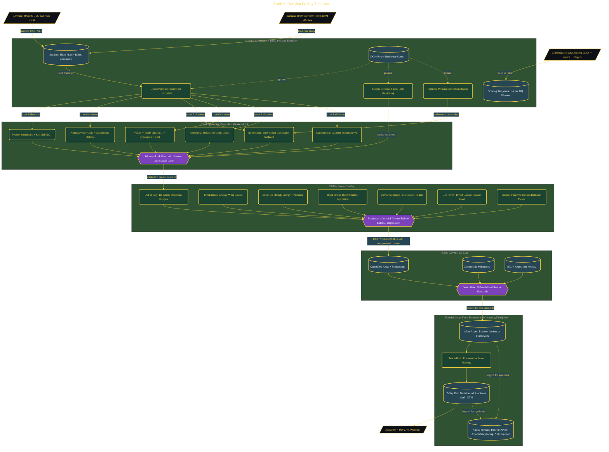

# Stanford Decision Quality Simulator

> Inside the [Leadership Systems Engineering](../../README.md) portfolio · *Leadership frameworks from formal coursework, engineered as working systems.*

## Overview

This project builds a structured decision simulator designed to apply Stanford GSB's Decision Quality framework and Pfeffer's Power framework to high-stakes business scenarios.

The system is built to move decision-making away from instinct-only reasoning and toward measurable decision quality. Instead of evaluating whether an outcome was successful after the fact, the simulator evaluates whether the decision process itself was structurally sound before execution begins. The focus is on framing, information quality, alternatives, trade-offs, reasoning, and organizational commitment under realistic operational pressure.

The simulator also introduces power dynamics as an execution layer. A technically correct strategy can still fail if stakeholder alignment, influence, and sequencing are ignored. The project combines both frameworks to evaluate not just what decision should be made, but whether the organization can realistically execute it.

The architecture is built across **8 phases**, anchored by **Building a Stanford-Grade Decision Simulator** on the input side and **Proving the Method Generalizes** at the end. Each phase is listed in the Implementation section below.

## Architecture

The diagram shows the topology and data flow of the system as built. The full architectural narrative, with screenshots and prose, lives in [`documents/stanford-decision-quality-simulator.md`](./documents/stanford-decision-quality-simulator.md).

## Implementation

This system is built across **8 phases**:

1. **Building a Stanford-Grade Decision Simulator**
2. **Mastering the DQ Six Elements and Power Frameworks**
3. **Applying DQ Frameworks to a Real Decision**
4. **Making the $400M NorthernTech AI Pivot Decision**
5. **Layering Pfeffer's Power Rules onto the Decision**
6. **Passing the Board Director Standards Gate**
7. **Teaching Back and Committing to Real-World Transfer**
8. **Proving the Method Generalizes**

For the full walkthrough with screenshots and step-by-step content, see [`documents/stanford-decision-quality-simulator.md`](./documents/stanford-decision-quality-simulator.md).

## Validation

Each build phase below is documented in [`documents/stanford-decision-quality-simulator.md`](./documents/stanford-decision-quality-simulator.md), with screenshots, configuration, and notes as captured during the build:

- ✅ Building a Stanford-Grade Decision Simulator
- ✅ Mastering the DQ Six Elements and Power Frameworks
- ✅ Applying DQ Frameworks to a Real Decision
- ✅ Making the $400M NorthernTech AI Pivot Decision
- ✅ Layering Pfeffer's Power Rules onto the Decision
- ✅ Passing the Board Director Standards Gate
- ✅ Teaching Back and Committing to Real-World Transfer
- ✅ Proving the Method Generalizes
