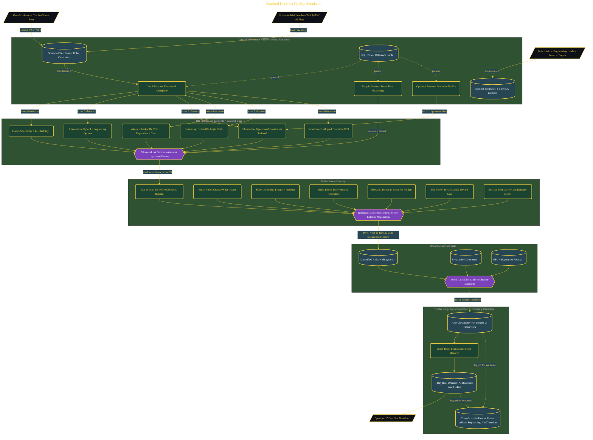

# Stanford Decision Quality Simulator

> Inside the [Leadership Systems Engineering](../../README.md) portfolio · *Leadership frameworks from formal coursework, engineered as working systems.*

## Overview

-T-h-i-s- -p-r-o-j-e-c-t- -b-u-i-l-d-s- -a- -s-t-r-u-c-t-u-r-e-d- -d-e-c-i-s-i-o-n- -s-i-m-u-l-a-t-o-r- -d-e-s-i-g-n-e-d- -t-o- -a-p-p-l-y- -S-t-a-n-f-o-r-d- -G-S-B-'-s- -D-e-c-i-s-i-o-n- -Q-u-a-l-i-t-y- -f-r-a-m-e-w-o-r-k- -a-n-d- -P-f-e-f-f-e-r-'-s- -P-o-w-e-r- -f-r-a-m-e-w-o-r-k- -t-o- -h-i-g-h---s-t-a-k-e-s- -b-u-s-i-n-e-s-s- -s-c-e-n-a-r-i-o-s-.-
-
-T-h-e- -s-y-s-t-e-m- -i-s- -b-u-i-l-t- -t-o- -m-o-v-e- -d-e-c-i-s-i-o-n---m-a-k-i-n-g- -a-w-a-y- -f-r-o-m- -i-n-s-t-i-n-c-t---o-n-l-y- -r-e-a-s-o-n-i-n-g- -a-n-d- -t-o-w-a-r-d- -m-e-a-s-u-r-a-b-l-e- -d-e-c-i-s-i-o-n- -q-u-a-l-i-t-y-.- -I-n-s-t-e-a-d- -o-f- -e-v-a-l-u-a-t-i-n-g- -w-h-e-t-h-e-r- -a-n- -o-u-t-c-o-m-e- -w-a-s- -s-u-c-c-e-s-s-f-u-l- -a-f-t-e-r- -t-h-e- -f-a-c-t-,- -t-h-e- -s-i-m-u-l-a-t-o-r- -e-v-a-l-u-a-t-e-s- -w-h-e-t-h-e-r- -t-h-e- -d-e-c-i-s-i-o-n- -p-r-o-c-e-s-s- -i-t-s-e-l-f- -w-a-s- -s-t-r-u-c-t-u-r-a-l-l-y- -s-o-u-n-d- -b-e-f-o-r-e- -e-x-e-c-u-t-i-o-n- -b-e-g-i-n-s-.- -T-h-e- -f-o-c-u-s- -i-s- -o-n- -f-r-a-m-i-n-g-,- -i-n-f-o-r-m-a-t-i-o-n- -q-u-a-l-i-t-y-,- -a-l-t-e-r-n-a-t-i-v-e-s-,- -t-r-a-d-e---o-f-f-s-,- -r-e-a-s-o-n-i-n-g-,- -a-n-d- -o-r-g-a-n-i-z-a-t-i-o-n-a-l- -c-o-m-m-i-t-m-e-n-t- -u-n-d-e-r- -r-e-a-l-i-s-t-i-c- -o-p-e-r-a-t-i-o-n-a-l- -p-r-e-s-s-u-r-e-.-
-
-T-h-e- -s-i-m-u-l-a-t-o-r- -a-l-s-o- -i-n-t-r-o-d-u-c-e-s- -p-o-w-e-r- -d-y-n-a-m-i-c-s- -a-s- -a-n- -e-x-e-c-u-t-i-o-n- -l-a-y-e-r-.- -A- -t-e-c-h-n-i-c-a-l-l-y- -c-o-r-r-e-c-t- -s-t-r-a-t-e-g-y- -c-a-n- -s-t-i-l-l- -f-a-i-l- -i-f- -s-t-a-k-e

The architecture is built across **8 phases**, anchored by **Building a Stanford-Grade Decision Simulator** on the input side and **Proving the Method Generalizes** at the end. Each phase is listed in the Implementation section below.

## Architecture

The diagram shows the topology and data flow of the system as built. The full architectural narrative, with screenshots and prose, lives in [`documents/stanford-decision-quality-simulator.md`](./documents/stanford-decision-quality-simulator.md).

## Implementation

This system is built across **8 phases**:

1. **Building a Stanford-Grade Decision Simulator**
2. **Mastering the DQ Six Elements and Power Frameworks**
3. **Applying DQ Frameworks to a Real Decision**
4. **Making the $400M NorthernTech AI Pivot Decision**
5. **Layering Pfeffer's Power Rules onto the Decision**
6. **Passing the Board Director Standards Gate**
7. **Teaching Back and Committing to Real-World Transfer**
8. **Proving the Method Generalizes**, -.

For the full walkthrough with screenshots and step-by-step content, see [`documents/stanford-decision-quality-simulator.md`](./documents/stanford-decision-quality-simulator.md).

## Validation

Build outcomes verified end-to-end. Each phase below is captured with screenshots, configuration, and observable behavior in [`documents/stanford-decision-quality-simulator.md`](./documents/stanford-decision-quality-simulator.md):

- ✅ Building a Stanford-Grade Decision Simulator
- ✅ Mastering the DQ Six Elements and Power Frameworks
- ✅ Applying DQ Frameworks to a Real Decision
- ✅ Making the $400M NorthernTech AI Pivot Decision
- ✅ Layering Pfeffer's Power Rules onto the Decision
- ✅ Passing the Board Director Standards Gate
- ✅ Teaching Back and Committing to Real-World Transfer
- ✅ Proving the Method Generalizes
