# Make Your Goals Checkable

> Inside the [Leadership Systems Engineering](../../README.md) portfolio · *Leadership frameworks from formal coursework, engineered as working systems.*

## Overview

I built this goals page to replace vague intentions with targets that could be checked from visible evidence. Each retained goal needed to identify the accountable person, state an exact deadline, and define a result that someone else could count. This made completion depend on recorded facts rather than my interpretation of whether I had made enough progress.

The system also separated goal writing from later judgment. I preserved the original list, measured its starting quality, rewrote selected goals, marked one genuine stretch target, and established review rules before tracking began. This sequence created a record of what changed and prevented the final evaluation from relying on memory. The page did not guarantee that I would complete every goal. It created a consistent way to determine whether I followed through, missed the target, needed to revise it, or should drop it after the review period.

The architecture is built across **5 phases**, anchored by **Setting a Clear Purpose for Checkable Goals** on the input side and **Testing Whether the Goals Are Truly Challenging** at the end. Each phase is listed in the Implementation section below.

## Architecture

```mermaid
---
title: Make Your Goals Checkable
---
%%{init: {"theme":"base","themeVariables": {"primaryColor":"#1B4332","primaryTextColor":"#F4D03F","primaryBorderColor":"#F4D03F","secondaryColor":"#264653","tertiaryColor":"#2F5233","lineColor":"#F4D03F","fontFamily":"ui-monospace, SFMono-Regular, Menlo, Consolas, monospace","fontSize":"13px"}}}%%
flowchart TD
    classDef datastore fill:#264653,stroke:#F4D03F,stroke-width:2px,color:#FFFFFF
    classDef service fill:#1B4332,stroke:#F4D03F,stroke-width:2px,color:#F4D03F
    classDef event fill:#7B42BC,stroke:#F4D03F,stroke-width:2px,color:#FFFFFF
    classDef io fill:#0d1117,stroke:#F4D03F,stroke-width:1.5px,color:#F4D03F,font-style:italic

    Owner[/The person accountable for the goals/]
    Stranger[/A stranger who must decide completion from the page alone/]

    subgraph Purpose["The standard, set before any goal was touched"]
        Replace{{Vague intentions replaced by targets checkable from visible evidence}}
        Split{{Goal writing separated from later judgment, so the evaluation never relies on memory}}
        NoGuarantee{{The page does not promise completion, it makes follow-through decidable}}
    end

    subgraph Baseline["The untouched starting list"]
        Workspace(Notion workspace created, nine goals entered before any criteria were seen)
        Frozen[("STARTING LIST: DO NOT EDIT, nine sentences")]
        WhyBlind{{Seeing the criteria first would have added dates and numbers while feeling like copying}}
        Score("Each sentence tested for a specific outcome, a number, and a deadline")
        ZeroOfNine[("0 of 9 pass: four had a number, five a specific action, none a deadline")]
        Denominator{{Every original sentence stays in the denominator, weak ones included}}
    end

    subgraph Rewrite["The stranger-checkable rule"]
        Three(Three to five goals retained and rewritten as one sentence each)
        OwnerRule[(Named owner: who is accountable)]
        DateRule[(Exact date: when the count is due)]
        CountRule[(Countable result: how much evidence completion requires)]
        AllThree{{All three or it fails the standard, each answers a different ambiguity}}
        NotValue{{Checkability is not difficulty and not personal value, those are judged separately}}
    end

    subgraph Precommit["Rules fixed before any result existed"]
        Hard[(One goal marked HARD as the declared stretch target)]
        Block[(Seven-line tracking block: baseline count, trigger, review period, cost, evidence, rule)]
        Threshold{{Keep at four of five days, drop at three or fewer, no undecided middle}}
        NoMove{{Three cannot become the bar afterwards, four cannot be raised for feeling easy}}
        Reminder{{A reminder clause that can only push toward Drop}}
        Independent{{So the rule measures independent action, not whether reminders produce compliance}}
    end

    subgraph Anchor["The trigger and the review"]
        Noon(Reading anchored to the first meal at noon, an existing daily calendar event)
        Rejected[(Work start, treadmill, and a chat app rejected as triggers)]
        WhyNoon{{They depend on notifications, so the review would measure reminder delivery instead}}
        Review[(66-day review scheduled before tracking began)]
        Cost{{The personal cost written on the page, so the target cannot be presented as effortless}}
    end

    subgraph RedTeam["Is HARD actually hard"]
        Objection1(Objection: the eating window is already routine)
        Survives[(Survives: three months of calendar events, no compliance record to refute it)]
        Objection2(Objection: the strength program is just showing up)
        Fails[(Fails: the program was six days old with no logged history)]
        Evidence{{An objection lives or dies on calendar, reminder settings, creation dates and logs, never on confidence}}
    end

    Owner -- "sets" --> Replace
    Replace -- "requires" --> Split
    Split -- "bounded by" --> NoGuarantee
    Owner -- "creates" --> Workspace
    Workspace -- "produces" --> Frozen
    Frozen -- "protected by" --> WhyBlind
    Frozen -- "scored by" --> Score
    Score -- "returned" --> ZeroOfNine
    ZeroOfNine -- "held honest by" --> Denominator
    ZeroOfNine -- "names the weakness for" --> Three
    Three -- "each carries" --> OwnerRule
    Three -- "each carries" --> DateRule
    Three -- "each carries" --> CountRule
    OwnerRule -- "together enforced as" --> AllThree
    AllThree -- "limited by" --> NotValue
    Three -- "one of which becomes" --> Hard
    Hard -- "sits above" --> Block
    Block -- "fixes" --> Threshold
    Threshold -- "prevents" --> NoMove
    Block -- "includes" --> Reminder
    Reminder -- "exists so that" --> Independent
    Block -- "names the trigger as" --> Noon
    Noon -- "chosen over" --> Rejected
    Rejected -- "because" --> WhyNoon
    Block -- "schedules" --> Review
    Block -- "records" --> Cost
    Hard -- "challenged by" --> Objection1
    Hard -- "challenged by" --> Objection2
    Objection1 -- "tested, and" --> Survives
    Objection2 -- "tested, and" --> Fails
    Survives -- "decided under" --> Evidence
    Fails -- "decided under" --> Evidence
    Fails -- "keeps the marker on" --> Hard
    AllThree -- "is what makes the page readable by" --> Stranger
    Review -- "hands the keep-or-drop decision to" --> Stranger
    NoGuarantee -- "is the promise made to" --> Owner

    class Frozen,ZeroOfNine,OwnerRule,DateRule,CountRule,Hard,Block,Rejected,Review,Survives,Fails datastore
    class Workspace,Score,Three,Noon,Objection1,Objection2 service
    class Replace,Split,NoGuarantee,WhyBlind,Denominator,AllThree,NotValue,Threshold,NoMove,Reminder,Independent,WhyNoon,Cost,Evidence event
    class Owner,Stranger io
```

The diagram shows the topology and data flow of the system as built. The full architectural narrative, with screenshots and prose, lives in [`documents/stranger-checkable-goals.md`](./documents/stranger-checkable-goals.md).

## Implementation

This system is built across **5 phases**:

1. **Setting a Clear Purpose for Checkable Goals**
2. **Preserving an Honest Starting Baseline**
3. **Building a Stranger-Checkable Goals System**
4. **Precommitting to a Hard Goal and Clear Decision Rules**
5. **Testing Whether the Goals Are Truly Challenging**

For the full walkthrough with screenshots and step-by-step content, see [`documents/stranger-checkable-goals.md`](./documents/stranger-checkable-goals.md).

## Validation

Each build phase below is documented in [`documents/stranger-checkable-goals.md`](./documents/stranger-checkable-goals.md), with screenshots, configuration, and notes as captured during the build:

- ✅ Setting a Clear Purpose for Checkable Goals
- ✅ Preserving an Honest Starting Baseline
- ✅ Building a Stranger-Checkable Goals System
- ✅ Precommitting to a Hard Goal and Clear Decision Rules
- ✅ Testing Whether the Goals Are Truly Challenging
