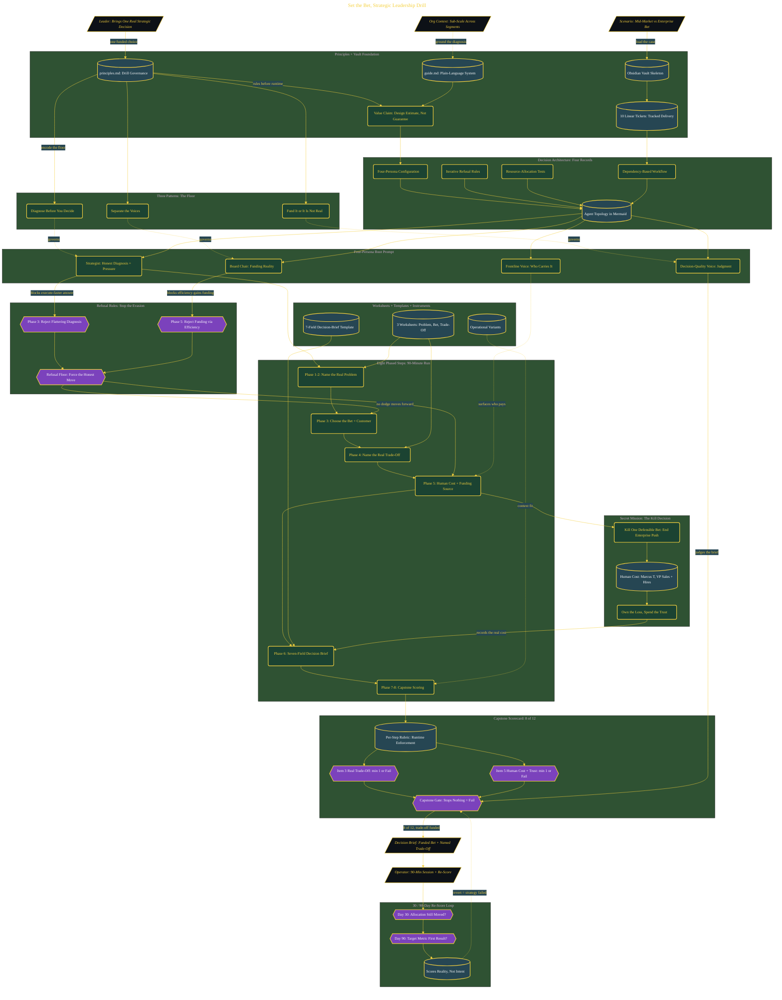

# Set the Bet: Strategic Leadership

> Inside the [Leadership Systems Engineering](../../README.md) portfolio · *Leadership frameworks from formal coursework, engineered as working systems.*

## Overview

In this build, I applied the strategic leadership drill to a real decision about where the organization should place its next bet. The work was not about making a better plan or adding more activity. It was about choosing a customer, moving resources, and naming what had to stop.

The real decision was whether to keep spreading effort across multiple directions or commit to a focused strategic bet. The drill forced the choice out of vague strategy language and into a funded trade-off.

This mattered because strategy is only real when money, people, and trust move. A plan that funds every option is not a bet. It is a delay with better formatting.

The architecture is built across **8 phases**, anchored by **The Strategic Bet I Chose to Own** on the input side and **Forcing the Kill Decision** at the end. Each phase is listed in the Implementation section below.

## Architecture

The diagram shows the topology and data flow of the system as built. The full architectural narrative, with screenshots and prose, lives in [`documents/strategic-bet-drill.md`](./documents/strategic-bet-drill.md).

## Implementation

This system is built across **8 phases**:

1. **The Strategic Bet I Chose to Own**
2. **Running the Drill: Decision Brief and Capstone Results**
3. **Shipping the Complete System to GitHub**
4. **Building the Principles and Vault Foundation**
5. **Designing the Agent Topology and Decision Architecture**
6. **Building the Four-Persona Drill and Scoring System**
7. **Worksheets, Templates, and Validation Instruments**
8. **Forcing the Kill Decision**

For the full walkthrough with screenshots and step-by-step content, see [`documents/strategic-bet-drill.md`](./documents/strategic-bet-drill.md).

## Validation

Each build phase below is documented in [`documents/strategic-bet-drill.md`](./documents/strategic-bet-drill.md), with screenshots, configuration, and notes as captured during the build:

- ✅ The Strategic Bet I Chose to Own
- ✅ Running the Drill: Decision Brief and Capstone Results
- ✅ Shipping the Complete System to GitHub
- ✅ Building the Principles and Vault Foundation
- ✅ Designing the Agent Topology and Decision Architecture
- ✅ Building the Four-Persona Drill and Scoring System
- ✅ Worksheets, Templates, and Validation Instruments
- ✅ Forcing the Kill Decision
